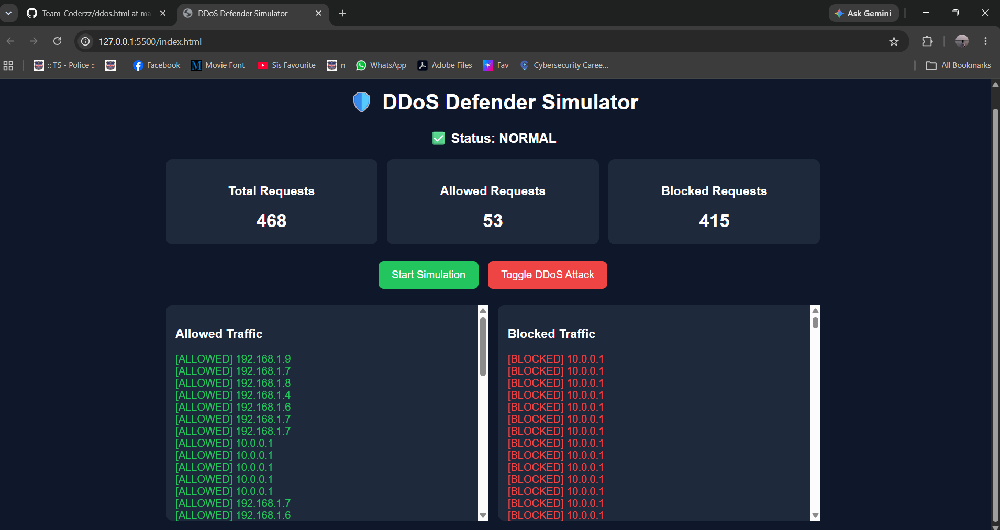

# 🛡️ DDoS Defender Simulator

## Description

The DDoS Defender Simulator is a web-based cybersecurity project that demonstrates how Distributed Denial of Service (DDoS) attacks can be detected and mitigated. The simulator generates network traffic, identifies suspicious requests, and blocks malicious traffic while allowing legitimate users to access the system.

---

## Features

- Real-time traffic simulation
- DDoS attack simulation mode
- Automatic blocking of suspicious requests
- Live request statistics dashboard
- Allowed traffic monitoring
- Blocked traffic monitoring
- Interactive and user-friendly interface

---

## Technologies Used

- HTML5
- CSS3
- JavaScript

---

## Project Structure

```text
DDOS-DEFENDER-SIMULATOR/
│
├── index.html
├── README.md
│
└── screenshots/
    ├── normal_mode.png
    └── attack_mode.png
```

---

## How to Run

1. Download or clone the repository.
2. Open the project folder.
3. Open `index.html` in a web browser.
4. Click **Start Simulation**.
5. Click **Toggle DDoS Attack** to simulate an attack.
6. Observe the dashboard statistics and traffic logs.

---

## Screenshots

### Normal Mode



### Attack Mode


---

## Output

The simulator displays:

- Total Requests
- Allowed Requests
- Blocked Requests
- Allowed Traffic Logs
- Blocked Traffic Logs
- Attack Status Monitoring

---

## Learning Outcomes

Through this project, I learned:

- Basics of DDoS attack behavior
- Traffic monitoring concepts
- Request filtering techniques
- Front-end development using HTML, CSS, and JavaScript
- Cybersecurity visualization concepts

---

## Author

**Rakshith Kumar**

DEFENDX
---